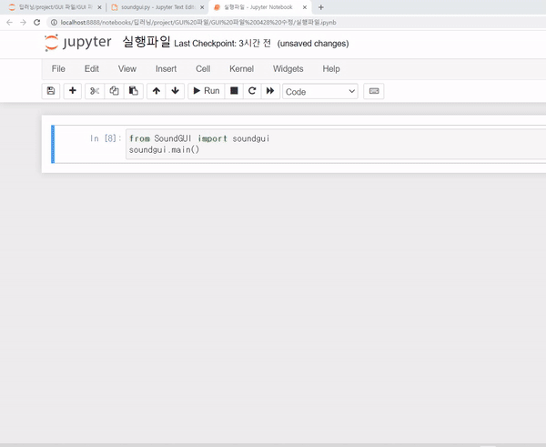
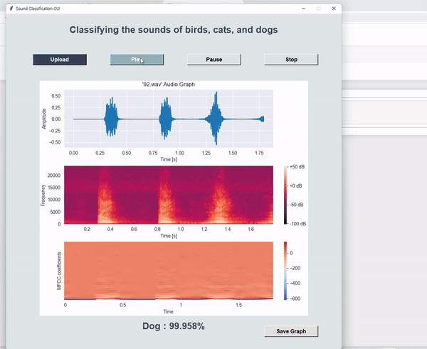

## 1. 프로젝트 설명 
- 개, 고양이, 새의 음성 데이터를 통하여 음성을 분류하는 인공신경망 모델 구축
- 인공신경망 모델을 기반으로 GUI를 구성해 사용자가 직접 음성을 넣어 테스트할 수 있도록 설계
- **MY ROLE** : 인공신경망 모델 기반 GUI 구현

## 2. GUI
**2-1) GUI 구현 목표**  
- 그래프를 통한 시각화 : Waveform plot / Spectrogram / MFCC  
- Upload, Play, Pause, Stop, Save Graph 구현  
- 모델 예측 결과를 % 비율로 표시  

**2-2) GUI 시연**  

  
   
   

